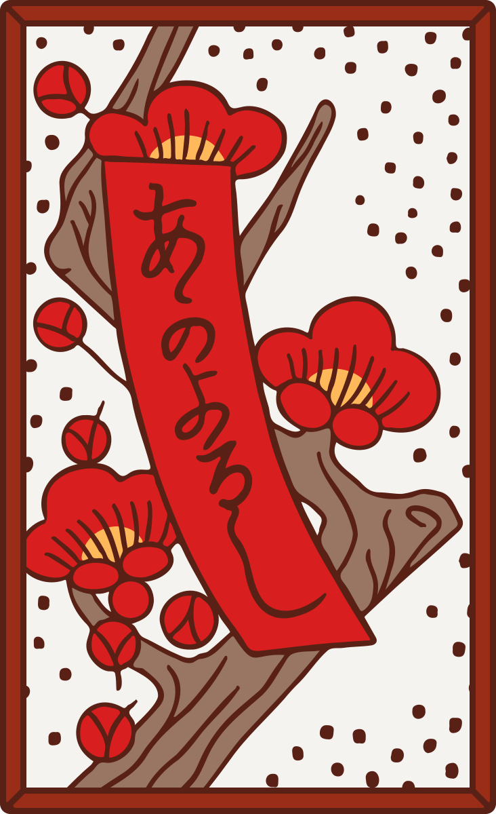
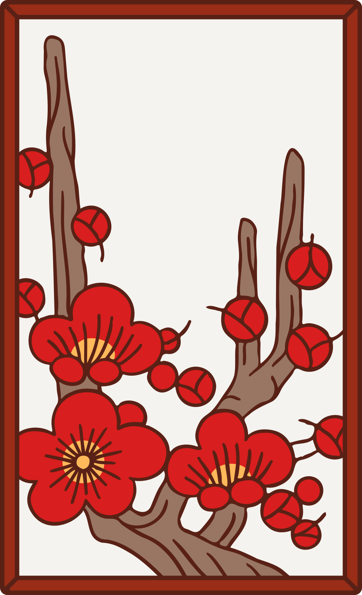
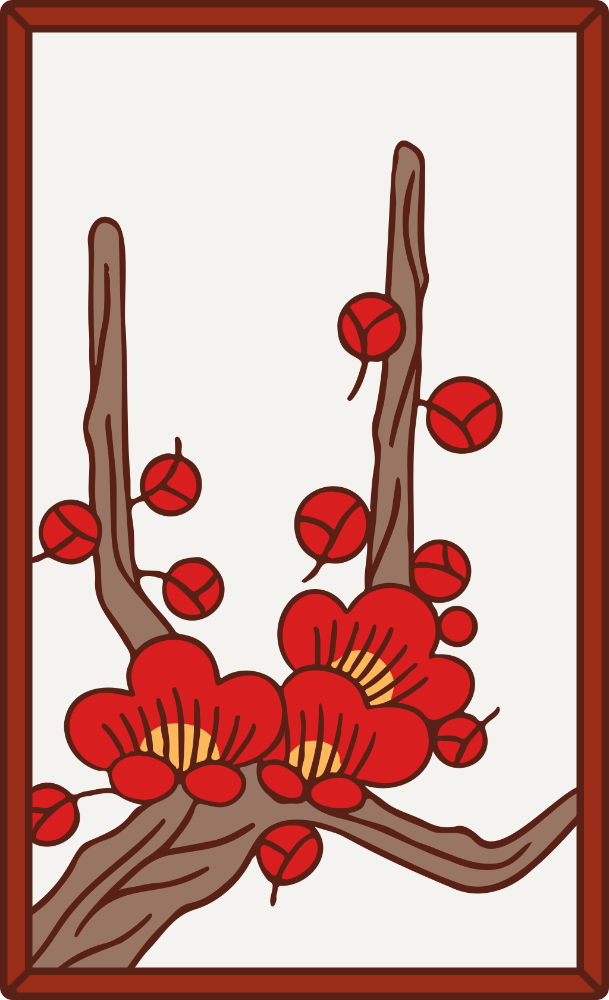

<div id="top"></div>


[](https://sonarcloud.io/summary/new_code?id=pmamico_hanafuda-lib)
[](https://sonarcloud.io/summary/new_code?id=pmamico_hanafuda-lib)
[](https://sonarcloud.io/summary/new_code?id=pmamico_hanafuda-lib)
[](https://sonarcloud.io/summary/new_code?id=pmamico_hanafuda-lib)
[](https://sonarcloud.io/summary/new_code?id=pmamico_hanafuda-lib)

<div align="center">
  <a href="https://github.com/pmamico/hanafuda-lib">
    
  </a>

  <h3 align="center">Hanafuda Lib</h3>

  <p align="center">
    A java library for Hanafuda cards.<br/ > 
    <font size="1">But <a href="#what-is-hanafuda">what is Hanafuda?</a></font>
  </p>
  
</div>


<!-- TABLE OF CONTENTS -->
<details>
  <summary>Table of Contents</summary>
  <ol>
    <li>
      <a href="#about-the-project">About The Project</a>
    </li>
    <li><a href="#usage">Usage</a></li>
    <li><a href="#roadmap">Roadmap</a></li>
    <li><a href="#contributing">Contributing</a></li>
    <li><a href="#what-is-hanafuda">What is Hanafuda?</a></li>
    <li><a href="#license">License</a></li>
    <li><a href="#contact">Contact</a></li>
  </ol>
</details>


<!-- ABOUT THE PROJECT -->
## About The Project

This repository is part of the [Koi Koi Online](https://github.com/users/pmamico/projects/2/) project.  
This is a library that represents a traditional [hanafuda deck](https://en.wikipedia.org/wiki/Hanafuda) only, no specific game logics.

<p align="right">(<a href="#top">back to top</a>)</p>

<!-- USAGE -->
## Usage

### Import with maven
```xml
<dependency>
    <groupId>io.github.pmamico</groupId>
    <artifactId>hanafuda-lib</artifactId>
    <version>1.0</version>
</dependency>
```
### Deck
```java
HanafudaDeck deck = new HanafudaDeck();
deck.shuffle();
PlayingCard cardFromTop = deck.draw();
```
A newly constructed ```HanafudaDeck``` contains all the 48 playing cards.
### Suits
Suits represented by ```HanafudaCardSuit``` enum  
Basically the suits are the 12 months.   
However it is supported to use flower names as aliases in english and romaji also.
e.g. the January suit is represented as ```HanafudaCardSuit.JAN```, ```HanafudaCardSuit.PINE``` or ```HanafudaCardSuit.MATSU```  
You can use the naming according to your taste!

### Values 
Values represented by ```HanafudaCardType``` enum.  
Values are ```PLAIN```, ```RIBBON```, ```BLUE_RIBBON```, ```POETRY_RIBBON```, ```ANIMAL``` and ```BRIGHT```

### PlayingCard
Cards represented by ```PlayingCard``` class having properties above:  
* a ```HanafudaCardSuit``` 
* a ```HanafudaCardType```
* a ```label``` (String)

### Special cards
All special cards that has unique name or role has an own class (that extends PlayingCard).  
For example "Full moon" is one of the bright cards and represented with ```FullMoon``` class so you can easily check against that or create it:
```java
//check if card is a full moon card
PlayingCard card = new HanafudaDeck().draw();
if(card instanceof FullMoon){
  ...
}

//or create a FullMoon card
PlayingCard fullMoon = new FullMoon();
```
Each special cards has a label, for example the FullMoon's label is "Full Moon with Red Sky".

<!-- ROADMAP -->
## Roadmap

See the [open issues](https://github.com/pmamico/hanafuda-lib/issues) for a full list of proposed features (and known issues).

<p align="right">(<a href="#top">back to top</a>)</p>

<!-- CONTRIBUTING -->
## Contributing

Contributions are what make the open source community such an amazing place to learn, inspire, and create. Any contributions you make are **greatly appreciated**.

If you have a suggestion that would make this better, please fork the repo and create a pull request. You can also simply open an issue with the tag "enhancement".
Don't forget to give the project a star! Thanks again!

1. Fork the Project
2. Create your Feature Branch (`git checkout -b feature/MyFeature`)
3. Commit your Changes (`git commit -m 'added my feature'`)
4. Push to the Branch (`git push origin feature/MyFeature`)
5. Open a Pull Request

<p align="right">(<a href="#top">back to top</a>)</p>

<!-- about-hanafuda -->
## What is Hanafuda?

Hanafuda or “flower cards” are a style of Japanese playing cards with some Portuguese backgrounds from the mid-16th century.   
Fun fact Nintendo originally produced handmade hanafuda playing cards in 1889.  
The system of the deck is different from French-suited or Bavarian pattern decks that makes the card intersting.  
A Hanafuda deck contains 48 cards in 12 suits, 4 cards each suit.  
Suits represented with characteristic flowers of the 12 months, eg. the "march" suit represented with cherry blossom.  
Each card has a "type" or "value" also, that can be "Plain", "Animal", "Ribbon", "Poetry ribbon", "Blue ribbon" or the most valuable type "Bright".   
Not all the suits has all value card which makes the deck asymmetric.  (there are 4 cards per suit, but there are 6 values)  
For example the February suited cards:  
<table>
   <tr>
     <td></td>
     <td></td>
     <td></td>
     <td></td>
     <td></td>
  </tr>
  <tr>
    <td>suit</td>
    <td colspan="4">plum blossom or february; suited cards illustrates the same flower</td>
  </tr>
  <tr>
    <td>type</td>
    <td>animal</td>
    <td>poetry ribbon</td>
    <td>plain</td>
    <td>plain</td>
  </tr>
</table>
All cards <a href="https://www.gamedesign.jp/flash/hanafuda/fuda2.png">here</a>.<br/ >
<br/ >
A typical game with Hanafuda cards called Koi-Koi <br/ >
where you match pairs by suit but you earn points for making combinations by type.<br/ >
You can check the actual rules here: <a href="https://www.gamedesign.jp/flash/hanafuda/rule_e.html">Hanafuda Rules</a> <br/ >
(NOTE combinations called Yaku)<br/ >

<p align="right">(<a href="#top">back to top</a>)</p>


<!-- LICENSE -->
## License

Distributed under the MIT License. See `LICENSE.txt` for more information.

<p align="right">(<a href="#top">back to top</a>)</p>

<!-- CONTACT -->
## Contact

Mico Papp - papp.mico@gmail.com

<p align="right">(<a href="#top">back to top</a>)</p>


<!-- MARKDOWN LINKS & IMAGES -->
<!-- https://www.markdownguide.org/basic-syntax/#reference-style-links -->
[contributors-shield]: https://img.shields.io/github/contributors/othneildrew/Best-README-Template.svg?style=for-the-badge
[contributors-url]: https://github.com/othneildrew/Best-README-Template/graphs/contributors
[forks-shield]: https://img.shields.io/github/forks/othneildrew/Best-README-Template.svg?style=for-the-badge
[forks-url]: https://github.com/othneildrew/Best-README-Template/network/members
[stars-shield]: https://img.shields.io/github/stars/othneildrew/Best-README-Template.svg?style=for-the-badge
[stars-url]: https://github.com/othneildrew/Best-README-Template/stargazers
[issues-shield]: https://img.shields.io/github/issues/othneildrew/Best-README-Template.svg?style=for-the-badge
[issues-url]: https://github.com/othneildrew/Best-README-Template/issues
[license-shield]: https://img.shields.io/github/license/othneildrew/Best-README-Template.svg?style=for-the-badge
[license-url]: https://github.com/othneildrew/Best-README-Template/blob/master/LICENSE.txt
[linkedin-shield]: https://img.shields.io/badge/-LinkedIn-black.svg?style=for-the-badge&logo=linkedin&colorB=555
[linkedin-url]: https://linkedin.com/in/othneildrew
[product-screenshot]: images/screenshot.png
